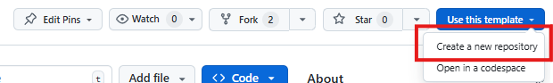
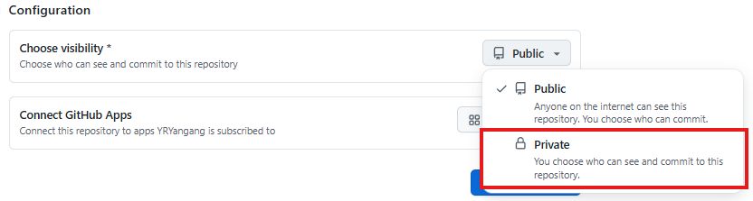
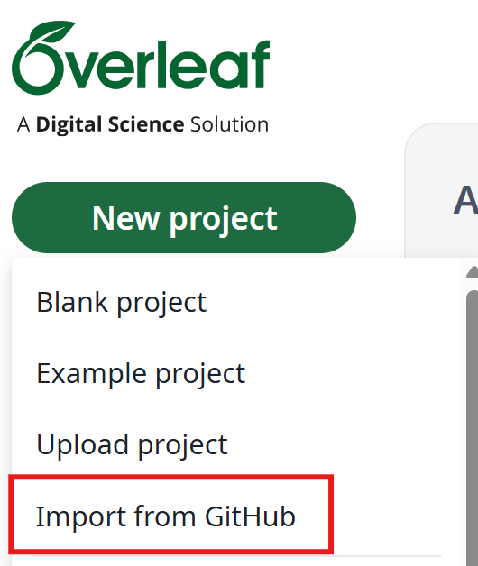

# COMP5423 Report Template
<div align="center">

</div>
<div align="center">

</div>

A LaTeX template for coursework reports in **COMP5423 - Natural Language Processing** at the Hong Kong Polytechnic University.

## Overview

This template provides a structured format for writing project.

## Project Structure

```
COMP5423-Report-Template/
├── COMP5423_reportTemplate.tex    # Main LaTeX document
├── notation.tex                    # Custom mathematical notation and commands
├── mybib.bib                       # Bibliography
├── figures/                        # Directory for figures
│   ├── goose.png
│   ├── ...
└── settings_do_not_modify/         # Template settings (do not modify)
    ├── includes.tex                # Package includes and settings
    ├── titlepage.tex               # Title page template
    └── contributions.tex           # Contributions page template
```

## Getting Started

### Prerequisites

- A LaTeX distribution (e.g., TeX Live, MiKTeX, or MacTeX), or
- A LaTeX editor (e.g., Overleaf, TeXstudio, or VS Code with LaTeX extensions) [recommended!]

### Compilation

To compile the document, use one of the following methods:

#### With pdflatex
```bash
pdflatex COMP5423_reportTemplate.tex
bibtex COMP5423_reportTemplate
pdflatex COMP5423_reportTemplate.tex
pdflatex COMP5423_reportTemplate.tex
```

#### With Overleaf

1. Use this repo as template:


2. Remember to set visibility to private:


3. Import your repo of this template from Overleaf:


## License

This template is provided for educational purposes for COMP5423 students at the Hong Kong Polytechnic University.

